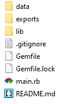
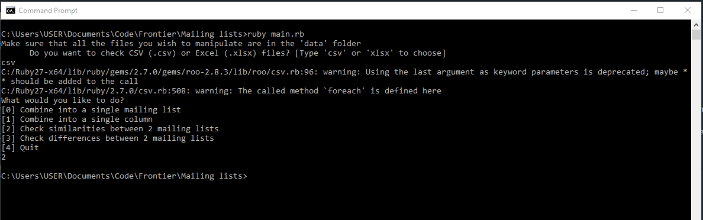

> This is a set of tools to manipulate mailing lists (in mail merge format) for Frontier

# Prerequisites
You will need `ruby 2.7.1` to run these tools. Assuming you're on a Windows PC, you can download ruby 2.7.1 [here](https://rubyinstaller.org/downloads/) - select the `Ruby+Devkit 2.7.1-1 (x64)` option. Only choose the `x86` option, if you don't have a 64-bit system.

(If you'd like to be fancy, you can install Ruby using the new Windows Sub-system for Linux - basically Ubuntu in Windows - follow [this tutorial](https://gorails.com/setup/windows/10) to install that. You can just install everything upto the section on Git).

After installing ruby, open a `command prompt` on your PC and navigate to the folder where you have downloaded and extracted these tools. Then run:

```
bundle install
```

This will install all the dependencies that these tools require.the folder where you have downloaded and extracted these tools.

If that doesn't work, you may need to install bundler first - to do so, run `gem install bundler`. Make sure you have at least Bundler version 2 installed (you can check this by running `bundle version` in your command prompt).

# Usage
1. Open a `command prompt` window and navigate to the folder where you have downloaded and extracted these tools. You can do that by running:
    ```
    cd exact/path/to/your/folder
    ```

    Where you replace `exact/path/to/your/folder` with the actual path to the folder where you have downloaded and extracted these tools (such as `C:\Users\USER\Documents\Mailing list tools`).

2. Create a `data` and an `exports` folder if they aren't already there.

    Your folder structure should look like this:

    

3. Copy all of the files that you wish to manipulate into the `data` folder. 

    **Do note that these tools are only equipped to manipulate files in the mail merge format which is exported from the [frontier-app](https://frontier-app.herokuapp.com/)**
    
    It is advised that you use the `Export this mailing list for SendGrid` option when exporting a mailing list from the app to be used with these tools (See the [Testing](#Testing) section below).

4. Then run:

    ```
    ruby main.rb
    ```

This will ask you if you want to manipulate CSV files or Excel files. Enter either `csv` or `xlsx` to choose. **Do note that these tools only work with one of these file types at a time, so make sure that all of the files in the `data` folder are of the same file type.**

The application will then ask you which of it's functions you want to use. The app currently supports the following functions:

1. ### Combine all mailing lists in the `data` folder into a single mailing list

    This will output a mailing list, in mail merge format with all the emails sorted by company and any duplicates removed.

2. ### Combine all mailing lists in the `data` folder into a single column

    This will output a CSV with all the emails from every company in a single column, with duplicates removed.

3. ### Check similarities between 2 mailing lists

    > **Only 2 files *must* be in the `data` folder for this to work**

    This will output a CSV where each row will be 1 company. 
    
    The second column will contain all the emails from that company which were present in both mailing lists. 
    
    The third row will contain the number of emails in column 2

4. ### Check differences between 2 mailing lists

    > **Only 2 files *must* be in the `data` folder for this to work**

    This will output a CSV where each row is 1 company. 

    The second column will show all the emails from the first mailing list that were not in the second one

    The third column will show all the emails from the second mailing list that were not in the first one


You can select the function you want by typing the number placed before each item.

After running the function, the app will export the data to a CSV file in the `exports` folder. Then the app will automatically quit. 

To run another manipulation, simply run the app again.

An example of the app after it hass finished running if given below:




# Testing
These tools have only been tested on the Econ Monthly mailing list (in SendGrid format - i.e. exported using the `Export this mailing list for SendGrid` option on the [frontier-app](https://frontier-app.herokuapp.com/)) and the Trader's Edge mailing list (also in SendGrid format).

While I am reasonably confident that it will work on any mailing list in the mail merge format, this has not been tested. Do let me know if you notice any errors.
